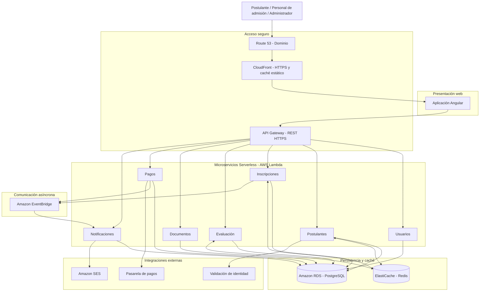
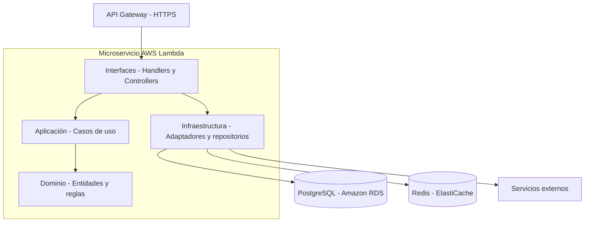
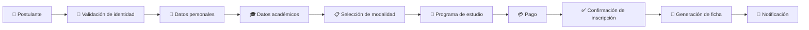

# Arquitectura inicial del sistema

## Sistema de Gestión del Proceso de Admisión UNSCH

La arquitectura propuesta se plantea a partir de las funcionalidades observables del proceso de admisión y busca proporcionar una solución segura, escalable y mantenible para la gestión de postulantes, inscripciones, pagos, documentos y resultados.

La arquitectura se organiza en una estructura de capas, incorporando una capa de acceso y seguridad, una capa de presentación, una capa de servicios, una capa de lógica de negocio, una capa de datos y servicios externos.

> **Nota:** Los componentes como CDN, WAF, balanceador de carga, caché y almacenamiento son parte de la **arquitectura propuesta** para el proyecto. No se afirma que estos componentes formen parte de la arquitectura interna actual de la UNSCH.

---

## 1. Diagrama de arquitectura 

### 5. Diagrama de arquitectura inicial



**Nota:** El diagrama representa una vista lógica inicial. Las conexiones con PostgreSQL indican persistencia de cada servicio, no acceso compartido indiscriminado a las mismas tablas. El certificado HTTPS se administrará mediante AWS Certificate Manager.

### 6. Estructura interna de los microservicios

Cada microservicio implementará Clean Architecture.



> **Escenario de carga:** aproximadamente 15 000 postulantes en periodos de inscripción. Se propone iniciar con una infraestructura pequeña y escalar las instancias detrás del balanceador según pruebas de carga; esta cifra es un objetivo de diseño, no una capacidad garantizada.
>
> La validación de identidad, la pasarela de pago y el correo son integraciones conceptuales; no se presupone proveedor ni integración real.

## 2. Componentes principales

### 2.1 Usuarios

La solución contempla tres tipos principales de usuarios:

| Usuario                  | Responsabilidad                                                                                       |
| ------------------------ | ----------------------------------------------------------------------------------------------------- |
| **Postulante**           | Realizar su inscripción, consultar información, realizar pagos y obtener sus documentos y resultados. |
| **Personal de Admisión** | Gestionar postulantes, inscripciones, modalidades, programas y procesos de admisión.                  |
| **Administrador**        | Administrar usuarios, configuraciones y funcionalidades generales del sistema.                        |

---

### 2.2 Capa de acceso y seguridad

Esta capa controla el acceso inicial de los usuarios al sistema.

| Componente               | Responsabilidad                                                                                       |
| ------------------------ | ----------------------------------------------------------------------------------------------------- |
| **DNS**                  | Permitir la resolución del dominio del sistema.                                                       |
| **CDN + WAF**            | Distribuir contenido, filtrar solicitudes maliciosas y proporcionar una capa adicional de protección. |
| **Balanceador de carga** | Distribuir las solicitudes entre las instancias disponibles del backend.                              |

Esta capa permite preparar la solución para periodos de alta demanda durante los procesos de inscripción.

---

### 2.3 Capa de presentación

#### Portal Web de Admisión

Es la interfaz mediante la cual los postulantes, personal de admisión y administradores interactúan con el sistema.

Entre sus principales funcionalidades se encuentran:

* Registro e inicio de sesión.
* Registro de datos personales.
* Registro de información académica.
* Selección de modalidad.
* Selección del programa de estudio.
* Consulta del estado de inscripción.
* Consulta y descarga de documentos.
* Consulta de resultados.

---

### 2.4 Capa de servicios

#### API REST

La API REST funciona como punto de comunicación entre el portal web y la lógica de negocio.

Sus responsabilidades principales son:

* Recibir solicitudes del portal web.
* Validar los datos recibidos.
* Gestionar las operaciones del sistema.
* Comunicar el frontend con los servicios de negocio.
* Gestionar las integraciones con servicios externos.
* Retornar las respuestas al portal web.

---

## 3. Lógica de negocio

La lógica de negocio concentra las funcionalidades principales del proceso de admisión.

### Autenticación y usuarios

Gestiona:

* Inicio de sesión.
* Control de acceso.
* Roles de usuario.
* Permisos.

### Gestión de postulantes

Gestiona la información de los postulantes:

* Datos personales.
* Datos académicos.
* Información de contacto.
* Documento de identidad.
* Fotografía.
* Historial de postulaciones.

### Gestión de inscripciones

Gestiona el proceso de inscripción:

* Registro de inscripción.
* Modalidad.
* Programa de estudio.
* Estado de inscripción.
* Confirmación de inscripción.

### Modalidades de admisión

Permite gestionar las diferentes modalidades disponibles dentro del proceso de admisión.

Por ejemplo:

* Proceso ordinario.
* Procesos de exonerados.

### Programas de estudio

Gestiona:

* Programas de estudio.
* Áreas.
* Sede.
* Información relacionada con la oferta académica.

### Gestión de pagos

Permite:

* Registrar pagos.
* Consultar el estado del pago.
* Validar operaciones.
* Asociar el pago con una inscripción.

### Gestión de documentos

Permite generar y consultar documentos relacionados con el postulante, tales como:

* Ficha de inscripción.
* Documentos de información del postulante.
* Constancias.
* Otros documentos generados por el proceso.

### Resultados

Permite gestionar y consultar:

* Resultados del proceso de admisión.
* Estado del postulante.
* Información relacionada con la evaluación.

### Notificaciones

Permite enviar:

* Confirmaciones de inscripción.
* Confirmaciones de pago.
* Avisos relacionados con el proceso.
* Notificaciones de generación de documentos.

---

# 4. Capa de datos

La capa de datos está compuesta por tres elementos principales.

### Base de datos

Almacena información estructurada relacionada con:

* Usuarios.
* Postulantes.
* Inscripciones.
* Modalidades.
* Programas de estudio.
* Pagos.
* Documentos.
* Resultados.

### Caché

Permite almacenar temporalmente información consultada frecuentemente para disminuir las solicitudes directas a la base de datos y mejorar los tiempos de respuesta.

Puede utilizarse principalmente para información como:

* Programas de estudio.
* Modalidades.
* Información pública.
* Resultados de consultas frecuentes.

### Almacenamiento de archivos

Permite almacenar archivos asociados al proceso de admisión, como:

* Fotografías.
* Fichas.
* Documentos generados.
* Comprobantes.
* Archivos proporcionados por los postulantes.

---

# 5. Servicios externos

La arquitectura contempla la integración con servicios externos.

### Servicio de validación de identidad

Permite validar los datos del documento de identidad del postulante antes de continuar con determinadas operaciones del proceso.

> Este servicio se considera una integración propuesta para la solución y no implica afirmar que el portal actual utilice directamente dicho servicio.

### Pasarela de pago

Permite procesar y validar los pagos asociados al proceso de admisión.

### Servicio de correo electrónico

Permite enviar notificaciones automáticas relacionadas con:

* Registro de inscripción.
* Confirmación de pago.
* Generación de documentos.
* Comunicaciones del proceso.

---

# 6. Flujo principal de la arquitectura

El flujo general de acceso al sistema es:

```text
Postulante
     │
     ▼
   DNS
     │
     ▼
 CDN + WAF
     │
     ▼
Balanceador de carga
     │
     ▼
 Portal Web
     │
     ▼
  API REST
     │
     ▼
Lógica de negocio
     │
     ▼
Base de datos
```

Los servicios externos se utilizan cuando una operación específica lo requiere:

```text
Gestión de postulantes
        │
        ▼
Validación de identidad
```

```text
Gestión de pagos
        │
        ▼
Pasarela de pago
```

```text
Inscripción / Documentos
        │
        ▼
Notificaciones
        │
        ▼
Servicio de correo
```

---

# 7. Flujo del proceso de inscripción



El flujo representa de manera conceptual las principales etapas que debe gestionar la solución propuesta.

---

# 8. Escalabilidad

La arquitectura considera la posibilidad de recibir una cantidad elevada de solicitudes durante los periodos de inscripción.

El balanceador de carga permite distribuir las solicitudes entre diferentes instancias del backend:

```text
                 Balanceador de carga
                         │
             ┌───────────┼───────────┐
             ▼           ▼           ▼
        ┌─────────┐ ┌─────────┐ ┌─────────┐
        │Backend 1│ │Backend 2│ │Backend 3│
        └────┬────┘ └────┬────┘ └────┬────┘
             │           │           │
             └───────────┼───────────┘
                         ▼
                Servicios de admisión
                         │
              ┌──────────┼──────────┐
              ▼          ▼          ▼
             BD        Caché     Storage
```

De esta manera, la arquitectura puede aumentar la cantidad de instancias disponibles cuando la demanda lo requiera, evitando depender de una única instancia de aplicación.

---

# 9. Arquitectura conceptual resumida

La solución propuesta puede resumirse de la siguiente manera:

```text
                         USUARIOS
                            │
                            ▼
                         INTERNET
                            │
                            ▼
                       DNS + WAF
                            │
                            ▼
                    BALANCEADOR DE CARGA
                            │
                            ▼
                     PORTAL WEB
                            │
                            ▼
                         API REST
                            │
                            ▼
                 ┌─────────────────────┐
                 │ LÓGICA DE NEGOCIO   │
                 │                     │
                 │ Postulantes         │
                 │ Inscripciones       │
                 │ Modalidades         │
                 │ Programas           │
                 │ Pagos               │
                 │ Documentos          │
                 │ Resultados          │
                 │ Notificaciones      │
                 └──────────┬──────────┘
                            │
              ┌─────────────┼─────────────┐
              ▼             ▼             ▼
           BASE DE        CACHÉ       STORAGE
            DATOS
                            │
                            │
              ┌─────────────┼─────────────┐
              ▼             ▼             ▼
        VALIDACIÓN       PASARELA       CORREO
        IDENTIDAD        DE PAGO
```

---

# 10. Justificación de la arquitectura

La arquitectura propuesta permite separar las responsabilidades del sistema en diferentes capas, facilitando su mantenimiento y evolución. La incorporación de mecanismos como CDN, WAF y balanceador de carga permite plantear una solución preparada para escenarios de alta demanda.

Asimismo, la separación entre la lógica de negocio, la base de datos y los servicios externos facilita la integración con mecanismos de validación de identidad, procesamiento de pagos y envío de notificaciones.

Esta arquitectura constituye una **propuesta inicial de alto nivel**, por lo que las tecnologías específicas de implementación podrán definirse posteriormente de acuerdo con los requerimientos funcionales, no funcionales, presupuesto y recursos disponibles del proyecto.
