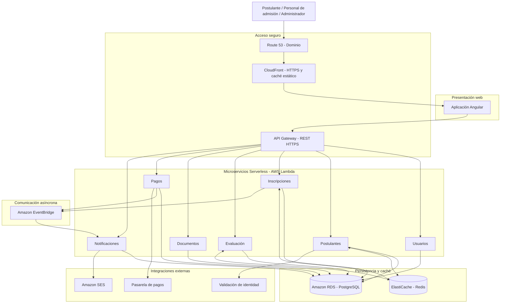
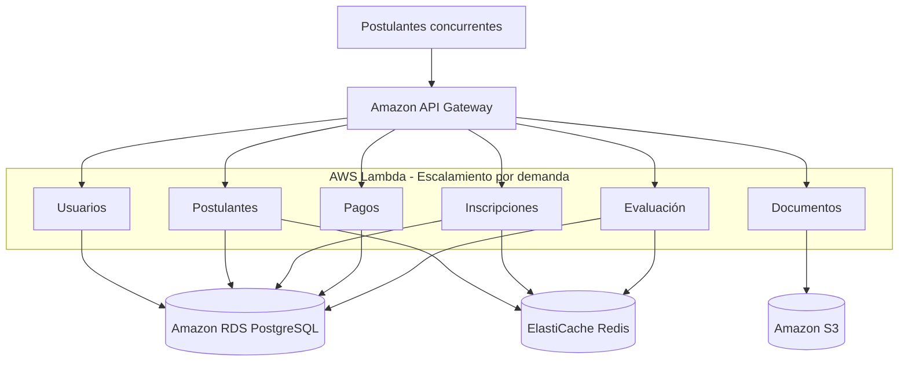
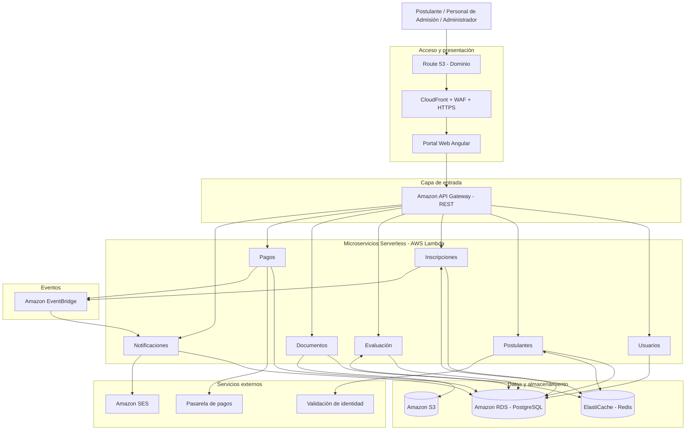
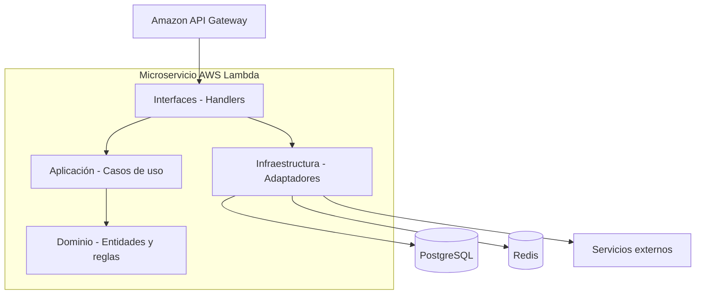

# Arquitectura inicial del sistema

## Sistema de Gestión del Proceso de Admisión UNSCH

La arquitectura propuesta se plantea a partir de las funcionalidades observables del proceso de admisión y busca proporcionar una solución segura, escalable y mantenible para la gestión de postulantes, inscripciones, pagos, documentos y resultados.

La arquitectura se organiza en una estructura de capas, incorporando una capa de acceso y seguridad, una capa de presentación, una capa de servicios, una capa de lógica de negocio, una capa de datos y servicios externos.

> **Nota:** Los componentes como CDN, WAF, balanceador de carga, caché y almacenamiento son parte de la **arquitectura propuesta** para el proyecto. No se afirma que estos componentes formen parte de la arquitectura interna actual de la UNSCH.

---

## 1. Diagrama de arquitectura 

### 5. Diagrama de arquitectura inicial



**Nota:** El diagrama representa una vista lógica inicial. Las conexiones con PostgreSQL indican persistencia de cada servicio, no acceso compartido indiscriminado a las mismas tablas. El certificado HTTPS se administrará mediante AWS Certificate Manager.


# Arquitectura Inicial del Sistema

## Sistema de Gestión del Proceso de Admisión

### 1. Descripción general de la arquitectura

Se propone una arquitectura de microservicios Serverless desplegada en Amazon Web Services (AWS), orientada a soportar los procesos de inscripción, gestión de postulantes, pagos, evaluación, documentación y publicación de resultados del Sistema de Gestión del Proceso de Admisión.

La arquitectura permitirá separar las funcionalidades del sistema en microservicios independientes, implementados mediante AWS Lambda y comunicados a través de API REST y eventos asíncronos.

Cada microservicio aplicará el enfoque Clean Architecture, organizando sus responsabilidades en cuatro capas: interfaces, aplicación, dominio e infraestructura.

La solución utilizará PostgreSQL mediante Amazon RDS para almacenar información estructurada, Amazon ElastiCache con Redis para optimizar las consultas frecuentes y Amazon S3 para almacenar archivos y documentos.

El portal web dispondrá de un dominio propio, conexiones HTTPS y mecanismos de seguridad para proteger la información personal y académica de los postulantes.

**Estilo arquitectónico:** Microservicios Serverless.

**Enfoque arquitectónico:** Clean Architecture.

**Infraestructura:** Amazon Web Services (AWS).

**Ejecución del backend:** AWS Lambda.

**Base de datos:** PostgreSQL en Amazon RDS.

**Caché:** Amazon ElastiCache con Redis.

**Comunicación:** API REST y eventos asíncronos.

**Seguridad web:** HTTPS mediante AWS Certificate Manager.

**Despliegue:** Serverless, sin Docker ni Kubernetes.

> **Escenario de carga:** Se considera aproximadamente 15 000 postulantes durante los periodos de inscripción. Esta cifra constituye un escenario de diseño y no representa una capacidad garantizada. La solución deberá validarse mediante pruebas de carga, considerando la concurrencia de AWS Lambda, los límites de Amazon API Gateway, el rendimiento de PostgreSQL y la capacidad del sistema de caché.
>
> La validación de identidad, la pasarela de pagos y el servicio de correo constituyen integraciones propuestas. Su implementación dependerá de la disponibilidad de los proveedores y de los acuerdos correspondientes.

---

## 2. Componentes principales

### 2.1. Usuarios

La solución contempla tres tipos principales de usuarios:

| Usuario | Responsabilidad |
|---|---|
| **Postulante** | Realizar su inscripción, consultar información, efectuar pagos y obtener documentos y resultados. |
| **Personal de Admisión** | Gestionar postulantes, inscripciones, modalidades, programas de estudio y procesos de admisión. |
| **Administrador** | Administrar usuarios, configuraciones, permisos y funcionalidades generales del sistema. |

---

### 2.2. Capa de acceso y seguridad

Esta capa controla el acceso de los usuarios al sistema y protege la comunicación entre la aplicación web y los microservicios.

| Componente | Responsabilidad |
|---|---|
| **Amazon Route 53** | Administrar el dominio del sistema y proporcionar resolución DNS. |
| **Amazon CloudFront** | Distribuir el contenido del portal web mediante una red de distribución de contenido y proporcionar caché de archivos estáticos. |
| **AWS WAF** | Filtrar solicitudes maliciosas y aplicar reglas de protección al tráfico web. |
| **AWS Certificate Manager** | Administrar certificados SSL/TLS para establecer conexiones HTTPS. |
| **Amazon API Gateway** | Recibir, controlar y enrutar las solicitudes REST hacia los microservicios implementados en AWS Lambda. |
| **Autenticación y autorización** | Verificar la identidad de los usuarios y controlar el acceso a las funcionalidades según sus roles y permisos. |

El sistema utilizará un dominio propio, por ejemplo:

`https://admision.tudominio.pe`

El dominio indicado es referencial y será reemplazado por el dominio definitivo del proyecto.

La comunicación entre el portal web y la API se realizará mediante HTTPS.

Amazon API Gateway proporcionará el punto de entrada a los microservicios, sin necesidad de incorporar un balanceador tradicional de instancias del backend.

---

### 2.3. Capa de presentación

#### Portal Web de Admisión

Es la interfaz mediante la cual los postulantes, el personal de admisión y los administradores interactúan con el sistema.

Se propone desarrollar el frontend mediante Angular, como una aplicación web de página única (SPA).

El portal podrá distribuirse mediante Amazon S3 y Amazon CloudFront.

Entre sus principales funcionalidades se encuentran:

- Registro e inicio de sesión.
- Registro de datos personales.
- Registro de información académica.
- Selección de modalidad de admisión.
- Selección del programa de estudio.
- Consulta del estado de inscripción.
- Consulta y descarga de documentos.
- Consulta de pagos.
- Consulta de resultados.
- Seguimiento del proceso de admisión.

El frontend se comunicará con el backend mediante solicitudes HTTPS a Amazon API Gateway.

---

### 2.4. Capa de servicios

#### API REST

La API REST constituye el mecanismo principal de comunicación entre el portal web y los microservicios.

Se utilizará Amazon API Gateway para administrar los endpoints y dirigir las solicitudes hacia las funciones AWS Lambda correspondientes.

Sus responsabilidades principales son:

- Recibir solicitudes HTTP del portal web.
- Enrutar las solicitudes hacia los microservicios.
- Aplicar mecanismos de autenticación y autorización.
- Controlar la frecuencia de solicitudes mediante límites de uso.
- Gestionar configuraciones de seguridad y acceso.
- Retornar las respuestas HTTP al frontend.

Las validaciones de negocio serán responsabilidad de los casos de uso y del dominio de cada microservicio.

#### Arquitectura de microservicios

Cada microservicio representará una capacidad específica del sistema y podrá evolucionar de forma independiente.

Los servicios serán implementados mediante AWS Lambda.

La comunicación entre microservicios podrá realizarse mediante API REST para operaciones síncronas y Amazon EventBridge para eventos asíncronos.

#### Enfoque Clean Architecture

Cada microservicio organizará internamente sus responsabilidades en cuatro capas:

| Capa | Responsabilidad |
|---|---|
| **Interfaces** | Recibir solicitudes mediante handlers y adaptadores de entrada. |
| **Aplicación** | Ejecutar casos de uso y coordinar operaciones del sistema. |
| **Dominio** | Definir entidades, reglas y validaciones del negocio. |
| **Infraestructura** | Implementar repositorios, acceso a PostgreSQL, caché e integraciones externas. |

Las dependencias del código deberán orientarse hacia el dominio y las abstracciones de aplicación.

La lógica de negocio no dependerá directamente de AWS Lambda, PostgreSQL ni de los proveedores externos.

---

## 3. Lógica de negocio

La lógica de negocio estará distribuida en microservicios independientes, cada uno responsable de una funcionalidad específica del proceso de admisión.

### 3.1. Microservicio de autenticación y usuarios

Gestiona:

- Inicio de sesión.
- Control de acceso.
- Roles de usuario.
- Permisos.
- Administración de cuentas.
- Actualización de información de usuario.

La autenticación podrá apoyarse en un servicio de identidad administrado, manteniendo la autorización de negocio según los roles establecidos.

### 3.2. Microservicio de postulantes

Gestiona la información de los postulantes:

- Datos personales.
- Datos académicos.
- Información de contacto.
- Documento de identidad.
- Fotografía.
- Historial de postulaciones.
- Actualización de información personal.

Este microservicio podrá comunicarse con un servicio externo autorizado para validar la identidad de los postulantes.

### 3.3. Microservicio de inscripciones

Gestiona el proceso de inscripción:

- Registro de inscripción.
- Selección de modalidad.
- Selección del programa de estudio.
- Estado de inscripción.
- Validación de requisitos.
- Confirmación de inscripción.
- Seguimiento de la inscripción.

Este microservicio deberá garantizar la integridad de las operaciones relacionadas con el registro de inscripciones.

### 3.4. Modalidades de admisión

Permite gestionar las diferentes modalidades disponibles dentro del proceso de admisión.

Por ejemplo:

- Proceso ordinario.
- Procesos de exonerados.

Esta funcionalidad podrá formar parte del microservicio de inscripciones o de un servicio de catálogos académicos, según el nivel de independencia requerido.

### 3.5. Programas de estudio

Gestiona:

- Programas de estudio.
- Áreas académicas.
- Sedes.
- Oferta académica.
- Información relacionada con los programas disponibles.

Los catálogos de programas y modalidades podrán almacenarse temporalmente en Redis para reducir consultas repetitivas a PostgreSQL.

### 3.6. Microservicio de pagos

Permite:

- Registrar operaciones de pago.
- Consultar el estado del pago.
- Validar operaciones.
- Asociar el pago con una inscripción.
- Procesar confirmaciones de la pasarela de pagos.
- Registrar identificadores de transacciones.

La integración con la pasarela de pagos se realizará mediante adaptadores externos.

Se implementarán mecanismos de idempotencia para evitar el procesamiento duplicado de una misma confirmación de pago.

### 3.7. Microservicio de documentos

Permite generar, almacenar y consultar documentos relacionados con el postulante, tales como:

- Ficha de inscripción.
- Documentos de información del postulante.
- Constancias.
- Comprobantes.
- Documentos proporcionados por el postulante.
- Otros documentos generados durante el proceso.

Los archivos se almacenarán en Amazon S3 y sus referencias o metadatos podrán registrarse en PostgreSQL.

### 3.8. Microservicio de evaluación y resultados

Permite gestionar y consultar:

- Evaluaciones.
- Resultados del proceso de admisión.
- Estado del postulante.
- Información relacionada con la evaluación.
- Publicación de resultados.
- Consultas autorizadas de resultados.

Las consultas frecuentes podrán optimizarse mediante Redis cuando las políticas de consistencia y confidencialidad lo permitan.

### 3.9. Microservicio de notificaciones

Permite enviar:

- Confirmaciones de inscripción.
- Confirmaciones de pago.
- Avisos relacionados con el proceso.
- Notificaciones de generación de documentos.
- Comunicaciones sobre resultados.

Este microservicio podrá recibir eventos mediante Amazon EventBridge y utilizar Amazon SES para el envío de correos electrónicos.

---

## 4. Capa de datos

La capa de datos estará compuesta por tres elementos principales.

### 4.1. Base de datos PostgreSQL

Se utilizará PostgreSQL mediante Amazon RDS para almacenar información estructurada relacionada con:

- Usuarios.
- Postulantes.
- Inscripciones.
- Modalidades.
- Programas de estudio.
- Pagos.
- Documentos.
- Evaluaciones.
- Resultados.
- Notificaciones.

Se aplicará el principio de propiedad de datos por microservicio.

Cada microservicio será responsable de sus propias entidades y operaciones de persistencia, evitando que otros servicios modifiquen directamente sus tablas.

Durante la etapa inicial, se podrá evaluar una instancia administrada de Amazon RDS con separación lógica de bases de datos o esquemas, manteniendo credenciales y permisos independientes.

Esta separación lógica no implica necesariamente una instancia física de base de datos por microservicio.

Para administrar eficientemente las conexiones provenientes de AWS Lambda, se evaluará la utilización de Amazon RDS Proxy.

La integridad de la información se garantizará mediante:

- Claves primarias y foráneas.
- Restricciones de integridad.
- Validaciones de negocio.
- Transacciones.
- Control de concurrencia.
- Prevención de operaciones duplicadas.

Las operaciones distribuidas entre microservicios requerirán mecanismos adicionales de coordinación y consistencia.

### 4.2. Caché Redis

Se utilizará Amazon ElastiCache con Redis para almacenar temporalmente información consultada con frecuencia y reducir las solicitudes directas a PostgreSQL.

El caché se utilizará principalmente para:

- Programas de estudio.
- Modalidades de admisión.
- Información pública.
- Catálogos académicos.
- Parámetros de configuración consultados frecuentemente.
- Resultados de consultas que admitan almacenamiento temporal.

Se propone utilizar el patrón Cache-Aside.

Su funcionamiento será:

1. El microservicio recibe una solicitud de consulta.
2. Verifica si la información está disponible en Redis.
3. Si existe y está vigente, devuelve la información almacenada.
4. Si no existe, consulta PostgreSQL.
5. Almacena temporalmente el resultado en Redis.
6. Devuelve la información al usuario.

Se establecerán políticas de expiración e invalidación para evitar la entrega de información desactualizada.

No se almacenará información personal sensible en caché sin controles adecuados de seguridad y una necesidad justificada.

### 4.3. Almacenamiento de archivos

Se utilizará Amazon S3 para almacenar archivos asociados al proceso de admisión, como:

- Fotografías.
- Fichas de inscripción.
- Documentos generados.
- Comprobantes.
- Archivos proporcionados por los postulantes.
- Documentación académica.

Los archivos privados deberán contar con controles de acceso, cifrado y mecanismos seguros de descarga.

---

## 5. Servicios externos

La arquitectura contempla la integración con servicios externos mediante adaptadores de infraestructura.

### 5.1. Servicio de validación de identidad

Permitirá validar los datos del documento de identidad del postulante antes de continuar con determinadas operaciones del proceso.

Se contempla la posible integración con RENIEC o un proveedor autorizado.

> Esta integración es una propuesta arquitectónica y no implica afirmar que exista actualmente un convenio o acceso habilitado al servicio.

### 5.2. Pasarela de pagos

Permitirá procesar y validar los pagos asociados al proceso de admisión.

Se contempla la integración con una pasarela compatible con los requisitos del proyecto.

Sus funciones podrán incluir:

- Generación de solicitudes de pago.
- Recepción de confirmaciones.
- Consulta del estado de las operaciones.
- Validación de transacciones.
- Comunicación del resultado al microservicio de inscripciones.

### 5.3. Servicio de correo electrónico

Se propone utilizar Amazon Simple Email Service (Amazon SES).

Permitirá enviar notificaciones automáticas relacionadas con:

- Registro de inscripción.
- Confirmación de pago.
- Generación de documentos.
- Publicación de resultados.
- Comunicaciones del proceso.

### 5.4. Comunicación asíncrona

Se utilizará Amazon EventBridge para facilitar la comunicación entre microservicios mediante eventos.

Entre los eventos propuestos se encuentran:

- InscripcionRegistrada.
- PagoConfirmado.
- DocumentoGenerado.
- ResultadoPublicado.

Esta comunicación permitirá reducir el acoplamiento entre servicios y ejecutar operaciones complementarias sin bloquear necesariamente la solicitud principal.

---

## 6. Flujo principal de la arquitectura

El flujo general de acceso al sistema es:

```text
                    USUARIOS
                       |
                       v
              DOMINIO PROPIO
               Amazon Route 53
                       |
                       v
              Amazon CloudFront
                 HTTPS + WAF
                       |
                       v
                PORTAL WEB
                  Angular
                       |
                       v
              Amazon API Gateway
                 REST + HTTPS
                       |
                       v
                AWS LAMBDA
                 Microservicios
                       |
          +------------+------------+
          |            |            |
          v            v            v
      PostgreSQL     Redis       Amazon S3
      Amazon RDS    ElastiCache   Archivos
```

Los microservicios se comunicarán con los servicios externos cuando una operación específica lo requiera.

### Validación de identidad

```text
Microservicio de Postulantes
             |
             v
 Adaptador de identidad
             |
             v
 Servicio externo autorizado
```

### Procesamiento de pagos

```text
Microservicio de Pagos
          |
          v
 Adaptador de pagos
          |
          v
  Pasarela de pagos
          |
          v
 Confirmación de pago
          |
          v
  Amazon EventBridge
          |
          v
Microservicio de Inscripciones
```

### Notificaciones

```text
Microservicio de Inscripciones
             |
             v
      Amazon EventBridge
             |
             v
Microservicio de Notificaciones
             |
             v
          Amazon SES
             |
             v
    Correo del postulante
```

---

## 7. Flujo del proceso de inscripción

```mermaid
flowchart LR
    A["Postulante"] --> B["Validación de identidad"]
    B --> C["Datos personales"]
    C --> D["Datos académicos"]
    D --> E["Selección de modalidad"]
    E --> F["Programa de estudio"]
    F --> G["Pago"]
    G --> H["Confirmación de inscripción"]
    H --> I["Generación de ficha"]
    I --> J["Notificación"]
```



El flujo representa conceptualmente las principales etapas que debe gestionar la solución propuesta.

Cada operación será atendida por el microservicio responsable de su funcionalidad.

Las operaciones que involucren distintos microservicios podrán coordinarse mediante API REST y eventos asíncronos.

---

## 8. Escalabilidad

La arquitectura considera la posibilidad de recibir una cantidad elevada de solicitudes durante los periodos de inscripción.

Se propone utilizar AWS Lambda para permitir el escalamiento independiente de los microservicios según la demanda.

Amazon API Gateway recibirá las solicitudes del portal web y las dirigirá hacia las funciones Lambda correspondientes.

La arquitectura no requerirá administrar manualmente múltiples instancias de servidores de aplicaciones ni incorporar un balanceador tradicional para distribuir solicitudes entre contenedores.

### Escalamiento Serverless



El escalamiento deberá considerar:

- Límites de concurrencia de AWS Lambda.
- Límites y cuotas de Amazon API Gateway.
- Capacidad de procesamiento de PostgreSQL.
- Administración de conexiones mediante RDS Proxy cuando corresponda.
- Optimización de consultas.
- Utilización de Redis para consultas frecuentes.
- Configuración de tiempos de espera.
- Monitoreo mediante Amazon CloudWatch.
- Pruebas de carga y rendimiento.

La capacidad real del sistema dependerá de los recursos contratados, las cuotas configuradas y los resultados de las pruebas.

---

## 9. Arquitectura conceptual resumida

La solución propuesta puede resumirse mediante el siguiente diagrama:



**Consideración arquitectónica:** Las conexiones hacia Amazon RDS representan la persistencia lógica de cada microservicio. No implican que todos los servicios deban compartir las mismas tablas o credenciales.

### Estructura interna de un microservicio

Cada microservicio aplicará Clean Architecture.



El diagrama representa el flujo de ejecución y las conexiones de infraestructura. En términos de dependencias del código, el dominio permanece independiente y los adaptadores de infraestructura implementan interfaces definidas por las capas internas.

---

## 10. Justificación de la arquitectura

La arquitectura propuesta responde a los siete drivers arquitectónicos identificados para el Sistema de Gestión del Proceso de Admisión.

| Driver | Necesidad arquitectónica | Solución propuesta |
|---|---|---|
| **DA01** | Escalabilidad | Microservicios Serverless mediante AWS Lambda. |
| **DA02** | Rendimiento | Amazon ElastiCache Redis, CloudFront y optimización del acceso a PostgreSQL. |
| **DA03** | Seguridad | HTTPS, AWS WAF, autenticación, autorización y control de acceso. |
| **DA04** | Integridad | PostgreSQL, validaciones de negocio y transacciones. |
| **DA05** | API REST | Amazon API Gateway para la comunicación entre frontend y backend. |
| **DA06** | Integraciones | Adaptadores para servicios de identidad y pasarelas de pago. |
| **DA07** | Mantenibilidad | Microservicios independientes y aplicación de Clean Architecture. |

### Justificación técnica

La selección del estilo de microservicios Serverless permite dividir las funcionalidades del sistema en servicios independientes, favoreciendo la escalabilidad y la evolución modular de la solución.

La utilización de AWS Lambda permitirá ejecutar los microservicios sin administrar servidores de aplicaciones, mientras que Amazon API Gateway centralizará el acceso mediante API REST.

La incorporación de Amazon ElastiCache con Redis permitirá reducir consultas repetitivas a PostgreSQL, contribuyendo a mejorar el rendimiento durante los periodos de alta concurrencia.

PostgreSQL mediante Amazon RDS proporcionará mecanismos de integridad referencial, restricciones y transacciones para garantizar la consistencia de las operaciones de cada servicio.

La aplicación de Clean Architecture permitirá separar las reglas de negocio de las tecnologías de infraestructura, facilitando el mantenimiento, las pruebas y la evolución independiente de los microservicios.

Asimismo, el uso de Amazon EventBridge permitirá implementar comunicación asíncrona entre servicios, reduciendo el acoplamiento y facilitando la ejecución de operaciones complementarias.

El acceso mediante un dominio propio y HTTPS proporcionará una comunicación cifrada entre los usuarios y el sistema.

### Conclusión

La arquitectura inicial propuesta combina el estilo de microservicios Serverless con el enfoque Clean Architecture, utilizando AWS Lambda para la ejecución de los servicios, Amazon API Gateway para la comunicación REST, PostgreSQL para la persistencia de datos, Redis para la optimización del rendimiento y Amazon S3 para el almacenamiento de archivos.

Esta organización establece una base arquitectónica modular, escalable, segura y mantenible para el Sistema de Gestión del Proceso de Admisión.

La propuesta constituye un diseño inicial de alto nivel que deberá validarse mediante pruebas de carga, seguridad, integridad y estimaciones de costos antes de su implementación definitiva.
