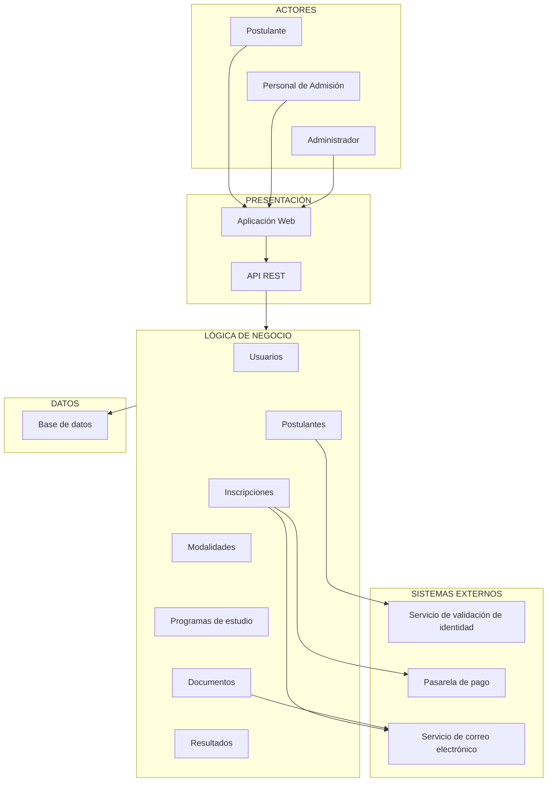

# Arquitectura inicial del sistema

## Sistema de Gestión del Proceso de Admisión

## 1. Diagrama de arquitectura



## 2. Descripción de la arquitectura

La arquitectura inicial se organiza en tres capas principales:

### Presentación

Permite la interacción de los postulantes, personal de admisión y administradores con el sistema mediante una aplicación web y una API REST.

### Lógica de negocio

Contiene los principales módulos responsables de las funcionalidades del sistema:

* Usuarios.
* Postulantes.
* Inscripciones.
* Modalidades.
* Programas de estudio.
* Documentos.
* Resultados.

### Datos

Permite almacenar y consultar la información relacionada con los postulantes, inscripciones, modalidades, programas de estudio, documentos y resultados mediante una base de datos.

### Sistemas externos

El sistema contempla integraciones con servicios externos para:

* Validar la identidad de los postulantes.
* Procesar pagos.
* Enviar confirmaciones y notificaciones.

## 3. Flujo principal

El flujo general de la solución es:

```text
Postulante
    ↓
Aplicación Web
    ↓
API REST
    ↓
Lógica de Negocio
    ↓
Base de Datos
```

Durante determinadas operaciones, la lógica de negocio se comunica con servicios externos:

```text
Postulantes ──────→ Servicio de validación de identidad

Inscripciones ────→ Pasarela de pago

Inscripciones ────→ Servicio de correo electrónico
```

## 4. Responsabilidad de las capas

| Capa              | Responsabilidad                                                            |
| ----------------- | -------------------------------------------------------------------------- |
| Presentación      | Permitir la interacción de los usuarios con el sistema.                    |
| Lógica de negocio | Procesar las reglas y operaciones relacionadas con el proceso de admisión. |
| Datos             | Almacenar y consultar la información del sistema.                          |
| Sistemas externos | Proporcionar servicios complementarios de validación, pago y notificación. |

```
```
