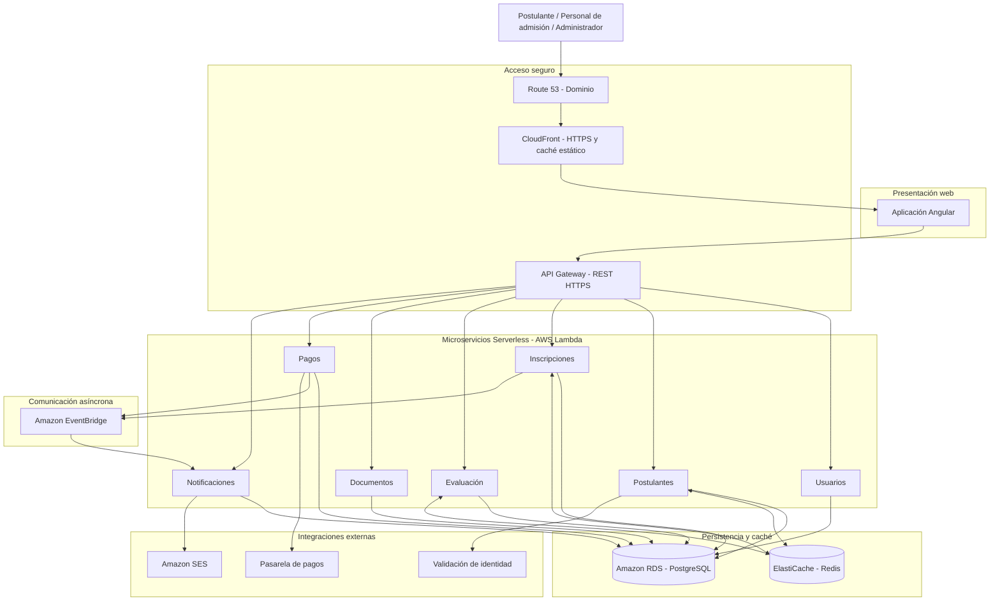

# Arquitectura inicial del sistema

## Sistema de Gestión del Proceso de Admisión

## Arquitectura de microservicios Serverless

La arquitectura inicial del sistema se organiza en tres capas principales: presentación, lógica de negocio y datos. Se utilizará una arquitectura de microservicios Serverless mediante AWS Lambda, aplicando Clean Architecture en cada microservicio.

> **Nota:** Los componentes como CDN, WAF, balanceador de carga, caché y almacenamiento son parte de la **arquitectura propuesta** para el proyecto. No se afirma que estos componentes formen parte de la arquitectura interna actual de la UNSCH.

---

## 1. Diagrama de arquitectura 

### 5. Diagrama de arquitectura inicial

**Nota:** El diagrama representa una vista lógica inicial. Las conexiones con PostgreSQL indican persistencia de cada servicio, no acceso compartido indiscriminado a las mismas tablas. El certificado HTTPS se administrará mediante AWS Certificate Manager.

# Arquitectura Inicial del Sistema

## Sistema de Gestión del Proceso de Admisión

### 1. Descripción general de la arquitectura

Se propone una arquitectura de microservicios Serverless desplegada en Amazon Web Services (AWS), orientada a soportar los procesos de inscripción, gestión de postulantes, pagos, evaluación, documentación y publicación de resultados del Sistema de Gestión del Proceso de Admisión.

La arquitectura permitirá separar las funcionalidades del sistema en microservicios independientes, implementados mediante AWS Lambda y comunicados a través de API REST y eventos asíncronos.

Cada microservicio aplicará el enfoque Clean Architecture, organizando sus responsabilidades en cuatro capas: interfaces, aplicación, dominio e infraestructura.

La solución utilizará PostgreSQL mediante Amazon RDS para almacenar información estructurada, Amazon ElastiCache con Redis para optimizar las consultas frecuentes y Amazon S3 para almacenar archivos y documentos.

El portal web dispondrá de un dominio propio, conexiones HTTPS y mecanismos de seguridad para proteger la información personal y académica de los postulantes.

**Estilo arquitectónico:** Microservicios Serverless.

**Enfoque arquitectónico:** Clean Architecture.

**Infraestructura:** Amazon Web Services (AWS).

**Ejecución del backend:** AWS Lambda.

**Base de datos:** PostgreSQL en Amazon RDS.

**Caché:** Amazon ElastiCache con Redis.

**Comunicación:** API REST y eventos asíncronos.

**Seguridad web:** HTTPS mediante AWS Certificate Manager.

**Despliegue:** Serverless, sin Docker ni Kubernetes.

> **Escenario de carga:** Se considera aproximadamente 15 000 postulantes durante los periodos de inscripción. Esta cifra constituye un escenario de diseño y no representa una capacidad garantizada. La solución deberá validarse mediante pruebas de carga, considerando la concurrencia de AWS Lambda, los límites de Amazon API Gateway, el rendimiento de PostgreSQL y la capacidad del sistema de caché.
>
> La validación de identidad, la pasarela de pagos y el servicio de correo constituyen integraciones propuestas. Su implementación dependerá de la disponibilidad de los proveedores y de los acuerdos correspondientes.

---

## Descripción

La arquitectura inicial se organiza en tres capas principales:

- **Presentación:** permite la interacción de los postulantes, personal de admisión y administradores mediante una aplicación web Angular, comunicada con el backend a través de una API REST con HTTPS.

- **Lógica de negocio:** contiene los microservicios de usuarios, postulantes, inscripciones, evaluación, documentos, pagos y notificaciones, implementados mediante AWS Lambda y organizados internamente con Clean Architecture.

- **Datos:** almacena y permite consultar la información del sistema mediante PostgreSQL en Amazon RDS, utiliza Redis como caché para mejorar el rendimiento y Amazon S3 para almacenar documentos y archivos.

Además, la lógica de negocio se integra con servicios externos de validación de identidad, pasarela de pagos y correo electrónico. El sistema contará con dominio propio, acceso seguro mediante HTTPS y comunicación asíncrona entre microservicios mediante Amazon EventBridge.